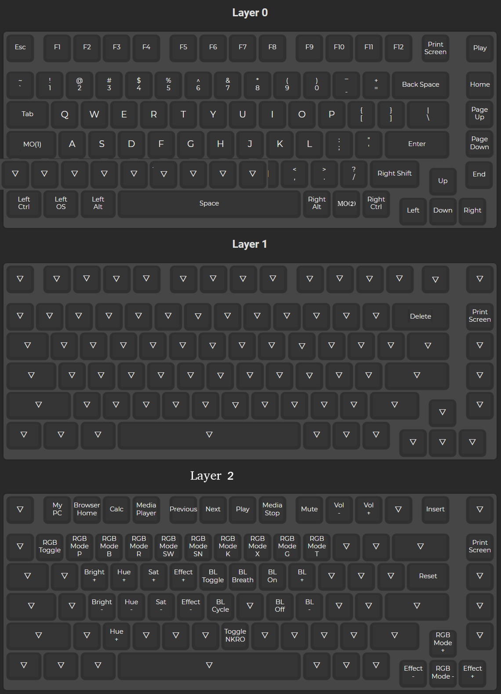

# GMMK Pro firmware custom key mapping with knob volume

This is my custom GMMK Pro configuration with the knob volume enabled.

VIA software is not enabled in this version.



## Install QMK tools and configure everything

Clone the QMK firmware repo:

```bash
git clone https://github.com/qmk/qmk_firmware.git
```

Following the official QMK guide to setup everything:
<https://docs.qmk.fm/#/newbs_getting_started>

At the end of the guide you should be able to run the following command and be able build everything successfully:

```bash
qmk compile -kb gmmk/pro/ansi -km default
```

## Add and build the custom keymap

Copy custom keymap directory into QMK firmware repo:

```bash
cd ~/qmk-gmmk-pro-key-mapping
cp -r default-with-knob ~/qmk_firmware/keyboards/gmmk/pro/ansi/keymaps/
```

Compile the GMMK Pro firmware with the custom keymap:

```bash
qmk compile -kb gmmk/pro/ansi -km matt-with-knob
```

To enter QMK flash mode (DFU) you need to press the keys `FN+\`.

```bash
qmk flash -kb gmmk/pro/ansi -km matt-with-knob
```

## Extra useful commands

Convert C to JSON keymap:

```bash
qmk c2json -kb gmmk/pro/ansi -km default-with-knob default-with-knob/keymap.c
```
